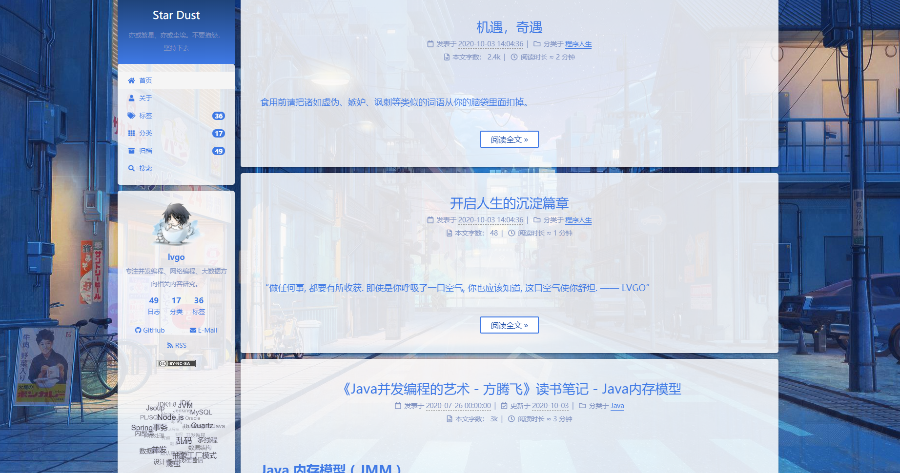
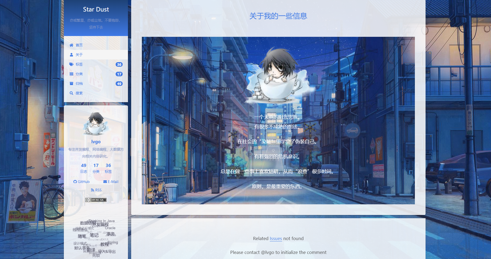

## lnext 蓝色调主题版本

Next 项目地址 : https://github.com/lvgocc/hexo-theme-lnext

## 效果图

### 首页

### about页

### 归档页

## 调整说明

整体颜色以蓝色为主. 与红色做为撞色搭配. (我就是瞎配, 完全不懂设计). 凭感觉让它变得更"轻盈"的感觉.
主题背景为日漫插画风. 网上一抓一大把. 不商用, 无利益, 侵权删. 其他图片图标也都是来自网上.

## 使用说明

将 _data/styles.styl 文件复制到站点目录 source 下重启即可.

对于其中引用的路径图片等可自行创建目录选择图片. 如果你觉得还不错的话, 欢迎使用, 给个 star ⭐

## 个人博客

http://lvgo.org
